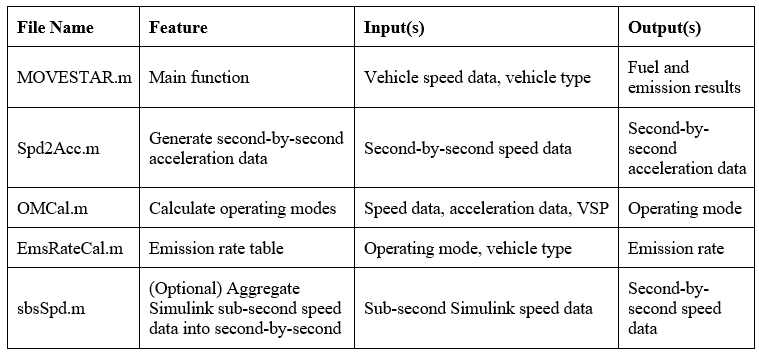
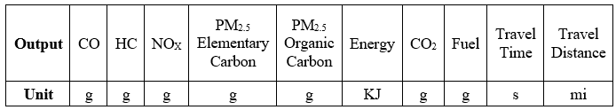

MOVESTAR: An Open-Source Vehicle Fuel and Emission Model based on USEPA MOVES
============

Authors
============

  Ziran Wang, Guoyuan Wu, George Scora\
  Center for Environmental Research and Technology\
  University of California, Riverside\
  zwang050@ucr.edu, gywu@cert.ucr.edu, gscora@cert.ucr.edu
  

Open-Source Implementation in Various Platforms
===============================================

Mathworks MATLAB
----------------

MOVESTAR model is implemented in Mathworks MATLAB as ".m"
files that can process the speed data generated by vehicles in
advance. There are five files in the MATLAB version of MOVESTAR
model, where their features, inputs and outputs are listed in the 
following table.

In the current MATLAB version of MOVESTAR model, there are only two
different vehicle types that the user needs to choose from. If the user
specify "1" in the main function "MOVESTAR.m", then the tested vehicle
is assumed as a light-duty vehicle; Otherwise, if "2" is entered, then
the tested vehicle is assumed as a light-duty truck.

In terms of the other input of MOVESTAR model besides the vehicle type,
the vehicle speed data needs to be processed by the user in the
second-by-second format. If the user generates the data by MATLAB
Simulink, MOVESTAR model provides a "spdSpd.m" file that can convert
sub-second speed data (in ".mat" format) into second-by-second speed
data.

The MATLAB version of MOVESTAR model provides two output files in ".dat"
format, where the one with an "ER" suffix means the "emission rate"
results, as shown in the following table. Additionally, MOVESTAR also provides the normalized
fuel and emission results based on the travel distance, which are
included in the file with a "EF" suffix (i.e., "emission factor").

