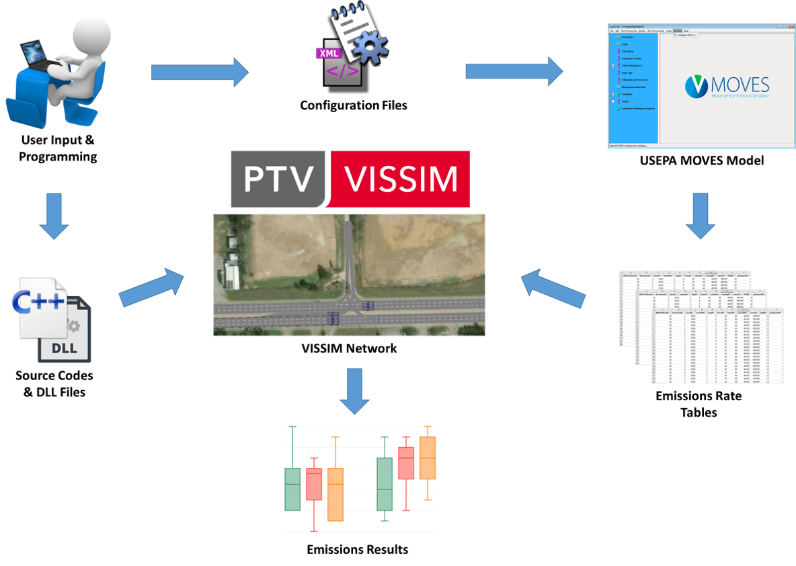
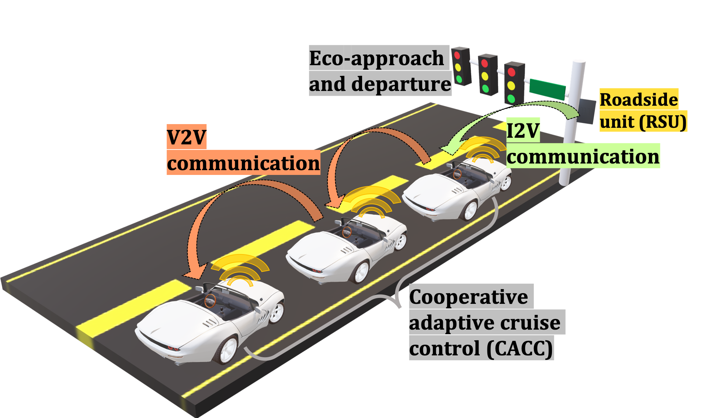
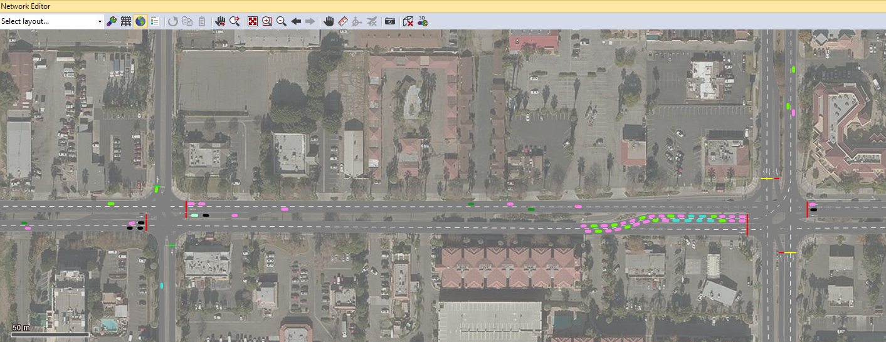
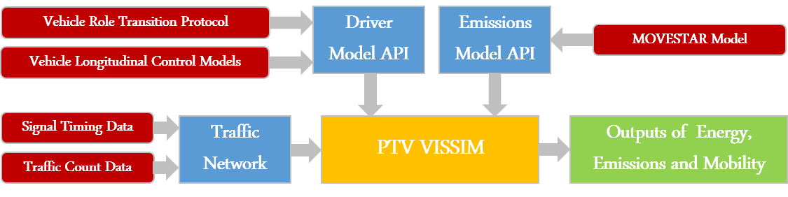
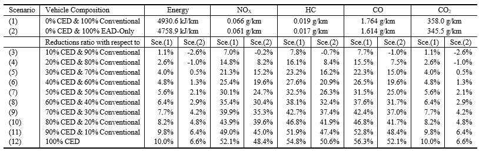

MOVESTAR: An Open-Source Vehicle Fuel and Emission Model based on USEPA MOVES
============

Authors
============

  Ziran Wang, Guoyuan Wu, George Scora\
  Center for Environmental Research and Technology\
  University of California, Riverside\
  zwang050@ucr.edu, gywu@cert.ucr.edu, gscora@cert.ucr.edu

Open-Source Implementation in Various Platforms
===============================================

Microscopic Traffic Simulator Vissim with C++ API
-------------------------------------------------

As a widely used microscopic traffic simulator, PTV Vissim
provides C++ API for users to load external emission models. MOVESTAR
model also provides a C++ project that can be integrated in Vissim to
calculate fuel and emission in real simulation time.

This C++ project includes an "EmissionModel.cpp" file and an
"EmissionModel.h" file. The ".cpp" file is the main script that includes
the calculations of VSP, operating mode, and emission rate. The ".h"
file is defined by Vissim to allow the user to interact with its API.
This "EmissionModel.vcxproj" project can be compiled to a ".dll" file,
which can be further loaded in Vissim GUI. The high-level integration
framework of MOVESTAR model in Vissim is illustrated as the following figure, while the
detailed integration steps should be referred to the Vissim manual.

Case Study and Results Evaluation
=================================

In this section, we perform a case study of MOVESTAR model based on a
cooperative eco-driving (CED) system with connected and automated
vehicles (CAVs). This case study develops a
system to improve the energy efficiency along a corridor with signalized
intersections. To study the effect of penetration rate of CAVs, two
different types of vehicles are defined in the system as conventional
vehicles and CED vehicles. The high-level concept of this CED system can
be illustrated as the following figure.

A microscopic traffic simulation network based on the real-world map in
Riverside, CA, USA is modeled in Vissim as figure
below, with real-world
signal phase and timing data and traffic count data. 

Different vehicle longitudinal control models and their relevant logic (e.g., role
transition) are integrated into the simulation network to simulate
vehicles' behavior. MOVESTAR fuel and emission model is implemented to
analyze the environmental impacts of the proposed CED system. This
integration architecture is illustrated in the following figure.

The simulation is conducted under different penetration rates of CED
vehicles and conventional vehicles. The simulation results are compared
with two baseline scenarios, where the first scenario contains 100%
conventional vehicles, and the second scenario contains 100%
eco-approach and departure (EAD) vehicles. EAD vehicles are CAVs that
conduct eco-driving maneuvers solely with the traffic signals, which do
not cooperate with other CAVs.

As can be seen from the following table,
the results of energy consumption, NOx emission, HC emission, CO
emission, and CO2 emission can all be calculated by MOVESTAR model in
different scenarios, which are eventually shown as relative values with
respect to two baseline scenarios. This case study validates the
effectiveness of the CED system, because the fuel and emission results
improve as the penetration rate of CED vehicles increases. All results
shown in this table are generated by the proposed MOVESTAR model.

